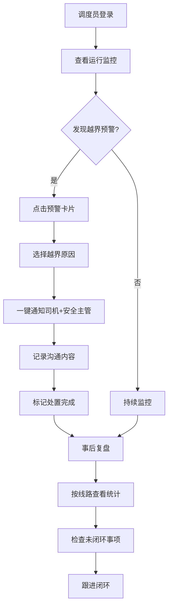

## 1. 产品概述

校车预警工作台是一款面向校车公司调度员的实时监控与处置系统，核心围绕"车辆有没有越界、谁来处理、处理到哪一步"三大问题，实现从实时监控、预警处置到事后复盘的全流程闭环管理。

- 目标用户：校车公司调度员、安全主管
- 核心价值：降低校车越界风险响应时间，确保每一条越界预警都有人跟、有记录、有结果

## 2. 核心功能

### 2.1 用户角色

| 角色 | 说明 | 核心权限 |
|------|------|----------|
| 调度员 | 日常值班人员 | 监控车辆、处置预警、查看复盘 |
| 安全主管 | 管理层 | 接收通知、查看复盘、审核闭环 |

### 2.2 功能模块

1. **运行监控页**：当天所有校车运行状态卡片，筛选与颜色标识
2. **预警处置页**：越界预警列表、原因确认、一键通知、沟通记录
3. **事后复盘页**：越界统计、处置记录、未闭环事项

### 2.3 页面详情

| 页面名称 | 模块名称 | 功能描述 |
|----------|----------|----------|
| 运行监控 | 顶部筛选栏 | 按学校、线路、车牌号筛选，状态快速切换（全部/正常/接近围栏/已越界） |
| 运行监控 | 车辆状态卡片网格 | 每张卡片显示车牌、线路名、当前状态颜色条（绿/黄/红）、最近更新时间 |
| 运行监控 | 车辆详情弹窗 | 电子围栏边界可视化、当前定位标注、最近进出围栏时间、随车照管员姓名 |
| 预警处置 | 预警列表 | 按时间倒序展示未处理/处理中预警，卡片突出显示越界时长 |
| 预警处置 | 原因选择弹窗 | 自动弹出，可选：临时绕行、道路施工、司机误驶、异常停靠，支持备注补充 |
| 预警处置 | 一键通知 | 确认原因后一键发送通知给司机和安全主管，记录通知时间与方式 |
| 预警处置 | 沟通记录 | 记录电话沟通内容：通话时间、沟通要点、对方确认情况 |
| 事后复盘 | 线路统计表 | 按线路汇总越界次数、平均持续时长、最长持续时长 |
| 事后复盘 | 处置记录列表 | 每条越界事件的处置人、处置时间、原因分类 |
| 事后复盘 | 未闭环事项 | 筛选出未完成闭环的预警，突出展示以便跟进 |

## 3. 核心流程

调度员登录系统后，首页展示当天所有校车的运行状态卡片。通过筛选条件定位目标车辆，点击卡片查看围栏详情。当车辆越界时系统自动弹出预警，调度员选择原因后一键通知相关人，并记录沟通内容。每日放学后通过复盘模块回顾当日越界情况。

## 4. 用户界面设计

### 4.1 设计风格

- **主色调**：深灰/炭黑背景 + 高对比状态色（绿/琥珀/红）
- **辅助色**：冷灰色系用于边框与分隔，白色用于主要文字
- **按钮风格**：微圆角（6px），状态色填充，hover 时微亮 + 阴影
- **字体**：标题使用 DM Sans（粗体），数据使用 JetBrains Mono，正文使用 DM Sans
- **布局风格**：左侧窄导航 + 右侧主内容区，卡片网格布局
- **图标风格**：Lucide 线性图标，2px 描边

### 4.2 页面设计概览

| 页面名称 | 模块名称 | UI 元素 |
|----------|----------|---------|
| 运行监控 | 顶部筛选栏 | 下拉选择器（学校/线路/车牌）、状态切换 Tab（全部/正常/接近围栏/已越界）、搜索输入框 |
| 运行监控 | 车辆卡片网格 | 3-4列响应式网格，每卡片左侧颜色条（4px）、车牌号（大字）、线路名、状态标签、更新时间 |
| 运行监控 | 车辆详情弹窗 | 右侧滑出抽屉式弹窗，上方围栏地图（SVG模拟），下方信息列表（定位/时间/照管员） |
| 预警处置 | 预警卡片列表 | 单列列表，左侧红色竖条，显示车牌+线路+越界时长+倒计时闪烁动画 |
| 预警处置 | 原因选择弹窗 | 居中模态框，4个原因按钮网格排列，底部备注输入+确认按钮 |
| 预警处置 | 通知与沟通区 | 时间轴形式展示通知记录和沟通内容，输入框记录新沟通 |
| 事后复盘 | 统计概览卡片 | 顶部3-4个统计卡片（越界总次数、平均时长、未闭环数） |
| 事后复盘 | 线路统计表格 | 表格展示各线路数据，支持排序 |
| 事后复盘 | 未闭环列表 | 带警告色标记的卡片列表 |

### 4.3 响应式设计

- 桌面优先设计，最小宽度 1280px
- 卡片网格在大屏4列、中屏3列、小屏2列自适应
- 侧边导航在移动端收起为汉堡菜单

### 4.4 动效设计

- 预警卡片入场：从左侧滑入 + 微弹
- 状态切换：卡片颜色过渡 300ms
- 越界预警脉冲：红色边框呼吸动画
- 弹窗展开：右侧滑出 300ms
- 数字变化：计数器滚动动画
