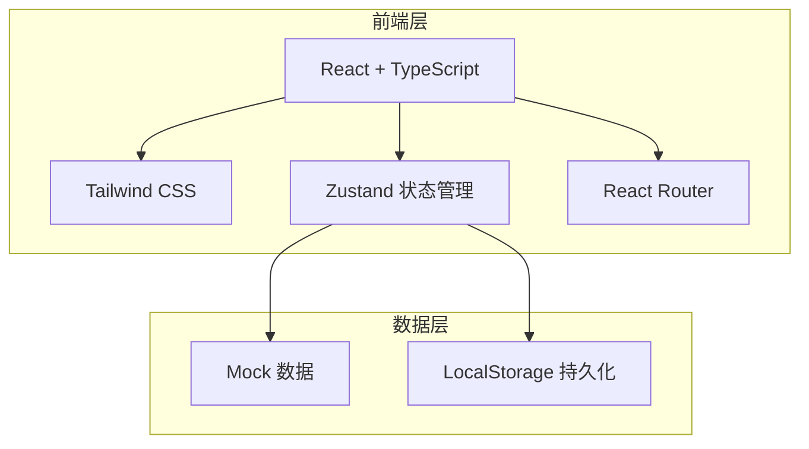
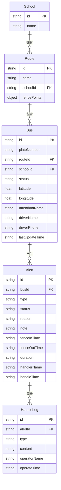

## 1. 架构设计

本项目为纯前端应用，使用 Mock 数据模拟后端接口，所有数据操作通过 Zustand Store 管理，部分数据持久化到 LocalStorage。

## 2. 技术说明

- **前端**：React@18 + TypeScript + Tailwind CSS@3 + Vite
- **初始化工具**：vite-init（react-ts 模板）
- **状态管理**：Zustand
- **路由**：react-router-dom@6
- **后端**：无（Mock 数据）
- **数据库**：无（LocalStorage 辅助持久化）
- **图标**：lucide-react

## 3. 路由定义

| 路由 | 用途 |
|------|------|
| / | 运行监控页 - 默认首页，展示车辆状态卡片 |
| /alerts | 预警处置页 - 越界预警列表与处置流程 |
| /review | 事后复盘页 - 统计分析与未闭环事项 |

## 4. 数据模型

### 4.1 数据模型定义

### 4.2 Mock 数据定义

提供以下预设数据：

- 3所学校：阳光小学、育才中学、星星幼儿园
- 每校2-3条线路，共8条线路
- 16辆校车，分布在不同状态（正常12辆、接近围栏2辆、已越界2辆）
- 5条预警记录（含2条未处理、1条处理中、2条已完成）
- 围栏数据为简化的多边形坐标点数组

## 5. 核心组件设计

| 组件名 | 所属模块 | 说明 |
|--------|----------|------|
| Layout | 全局 | 左侧导航 + 顶栏 + 主内容区 |
| Sidebar | 全局 | 导航菜单，图标+文字 |
| BusCard | 运行监控 | 车辆状态卡片 |
| BusDetailDrawer | 运行监控 | 车辆详情抽屉弹窗 |
| FenceMap | 运行监控 | SVG 模拟围栏地图 |
| FilterBar | 运行监控 | 顶部筛选栏 |
| AlertCard | 预警处置 | 预警卡片 |
| ReasonModal | 预警处置 | 原因选择弹窗 |
| NotifyPanel | 预警处置 | 通知与沟通记录面板 |
| Timeline | 预警处置 | 通用时间轴组件 |
| StatCard | 事后复盘 | 统计概览卡片 |
| RouteTable | 事后复盘 | 线路统计表格 |
| UnclosedList | 事后复盘 | 未闭环事项列表 |

## 6. 状态管理设计（Zustand Store）

| Store | 说明 |
|-------|------|
| useBusStore | 车辆列表、筛选条件、选中车辆 |
| useAlertStore | 预警列表、当前处置预警、处置操作 |
| useReviewStore | 复盘统计数据、筛选条件 |
